# 🧩 30 JavaScript Mini Projects

Коллекция из 30 мини-проектов, созданных с использованием **HTML, CSS и JavaScript**.  
Каждый проект — это отдельное приложение с реальной функциональностью: API, анимации, работа с DOM, localStorage и т.д.

---

## Оглавление

1. [Weather App](#1-weather-app)
2. [To Do List](#2-to-do-list)
3. [Quiz App](#3-quiz-app)
4. [Random Password Generator](#4-random-password-generator)
5. [Notes App](#5-notes-app)
6. [Age Calculator](#6-age-calculator)
7. [Quote Generator](#7-quote-generator)
8. [QR Code](#8-qr-code)
9. [Snack Bar](#9-snack-bar)
10. [Music Player](#10-music-player)
11. [Stopwatch](#11-stopwatch)
12. [Calculator](#12-calculator)
13. [Pop-up](#13-pop-up)
14. [Password Toggle](#14-password-toggle)
15. [Dark Mode](#15-dark-mode)
16. [Form Validation](#16-form-validation)
17. [Gallery](#17-gallery)
18. [Email Subscription](#18-email-subscription)
19. [Password Strength](#19-password-strength)
20. [Text to Speech](#20-text-to-speech)
21. [Coming Soon Page](#21-coming-soon-page)
22. [Background Change Effect](#22-background-change-effect)
23. [Mini Calendar](#23-mini-calendar)
24. [Menu](#24-menu)
25. [Circular Progress Bar](#25-circular-progress-bar)
26. [Product Page](#26-product-page)
27. [Cryptocurrency Tracker](#27-cryptocurrency-tracker)
28. [Drag and Drop](#28-drag-and-drop)
29. [Image Search Engine](#29-image-search-engine)
30. [Digital Clock](#30-digital-clock)

---

## 1. Weather App

Приложение для отображения погоды по городу. Использует OpenWeatherMap API. Показывает температуру, влажность, скорость ветра и погодную иконку.  
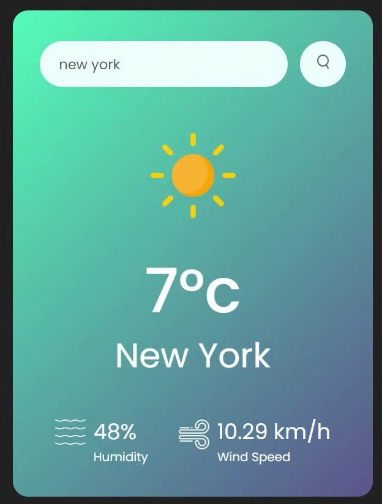

---

## 2. To Do List

Список задач с добавлением, удалением и отметкой выполненных задач. Данные сохраняются в localStorage.  
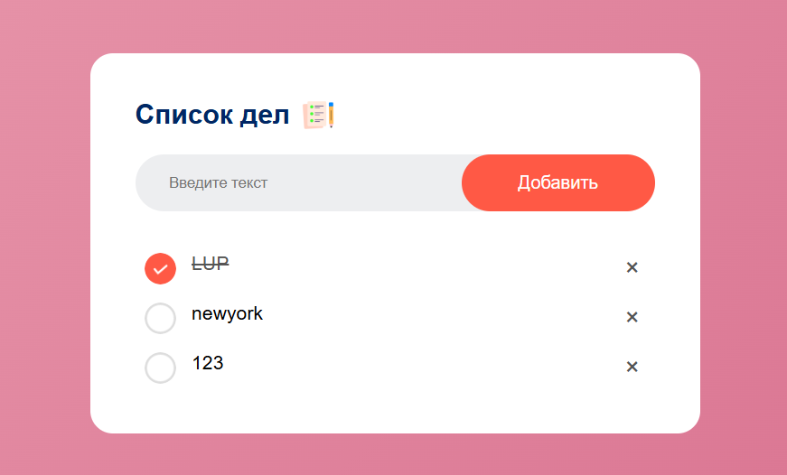

---

## 3. Quiz App

Викторина с вопросами и вариантами ответов. В конце показывается результат.  

---

## 4. Random Password Generator

Генератор паролей с настройкой длины и выбором символов (буквы, цифры, спецсимволы).  
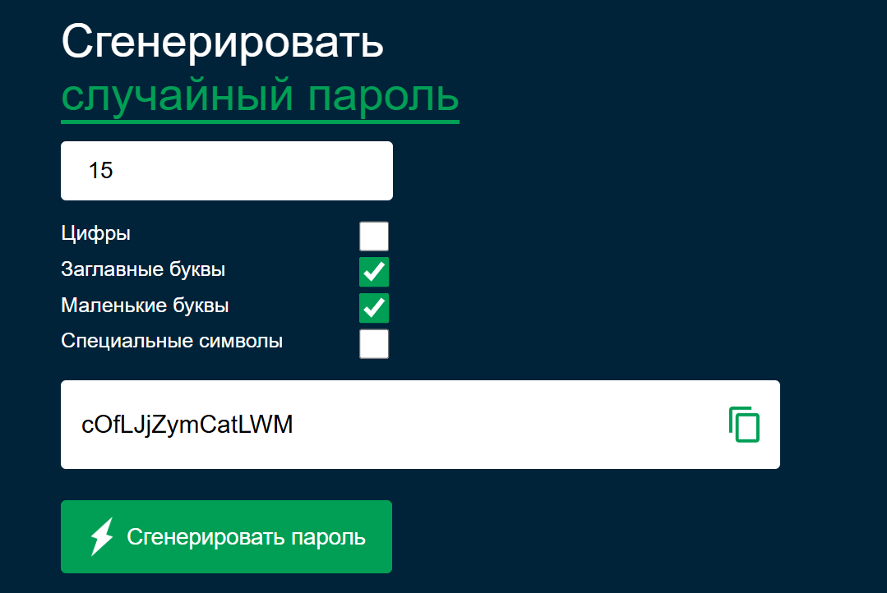

---

## 5. Notes App

Приложение для заметок с сохранением в localStorage.  
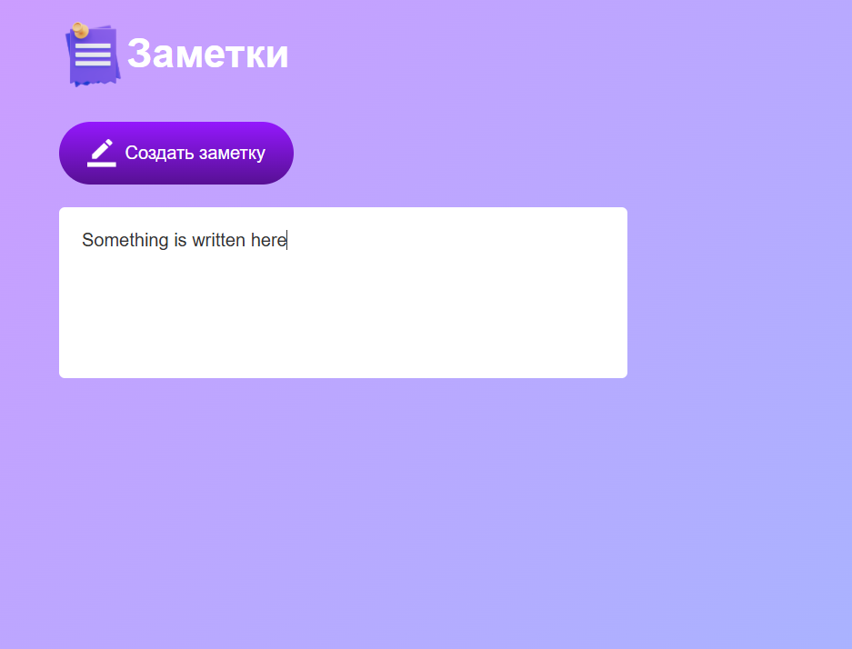

---

## 6. Age Calculator

Калькулятор возраста по дате рождения (годы, месяцы, дни).  
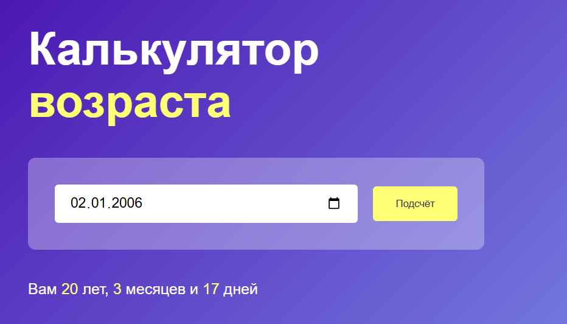

---

## 7. Quote Generator

Генератор случайных цитат через API.  

---

## 8. QR Code Generator

Создание QR-кода из текста или ссылки.  
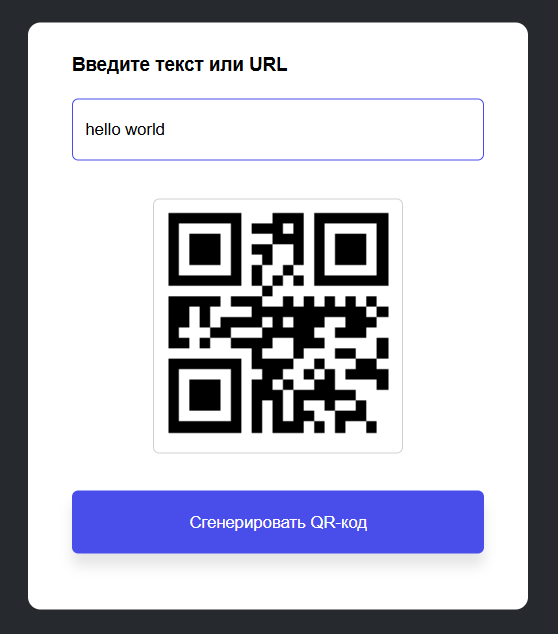

---

## 9. Snack Bar

Всплывающие уведомления (success / error / warning).  

---

## 10. Music Player

Аудиоплеер с play/pause и перемоткой.  

---

## 11. Stopwatch

Секундомер с запуском, паузой и сбросом.  
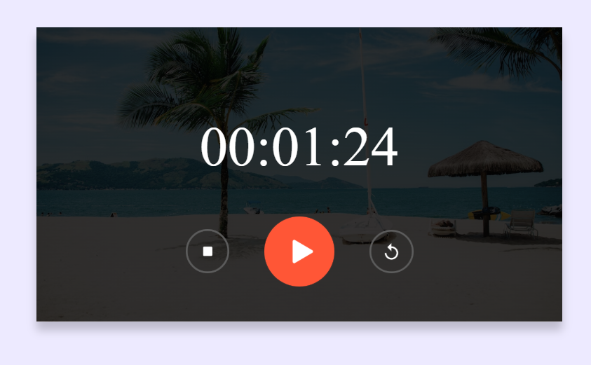

---

## 12. Calculator

Калькулятор с базовыми математическими операциями.  
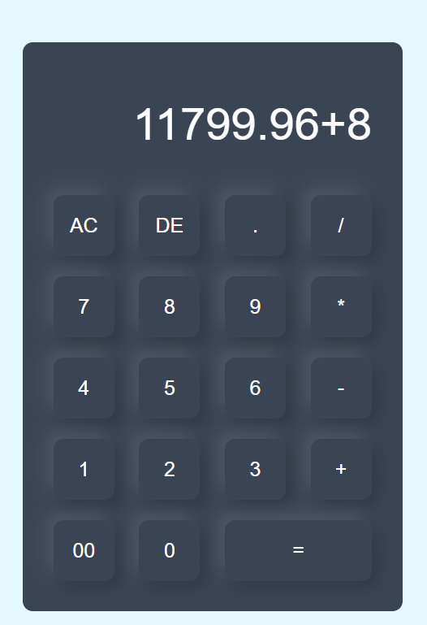

---

## 13. Pop-up

Модальное окно, открытие и закрытие по кнопке.  

---

## 14. Password Toggle

Показ / скрытие пароля.  

---

## 15. Dark Mode

Переключение светлой и тёмной темы с сохранением в localStorage.  

---

## 16. Form Validation

Валидация формы (email, телефон, имя) в реальном времени.  
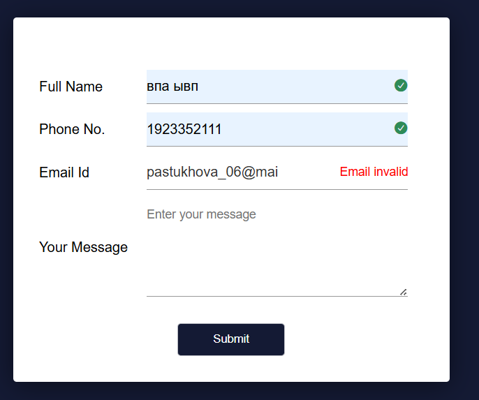

---

## 17. Gallery

Галерея изображений с прокруткой.  

---

## 18. Email Subscription

Форма подписки на email.  

---

## 19. Password Strength

Проверка сложности пароля (слабый / средний / сильный).  
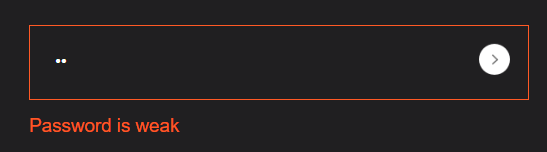

---

## 20. Text to Speech

Озвучка текста через Web Speech API.  
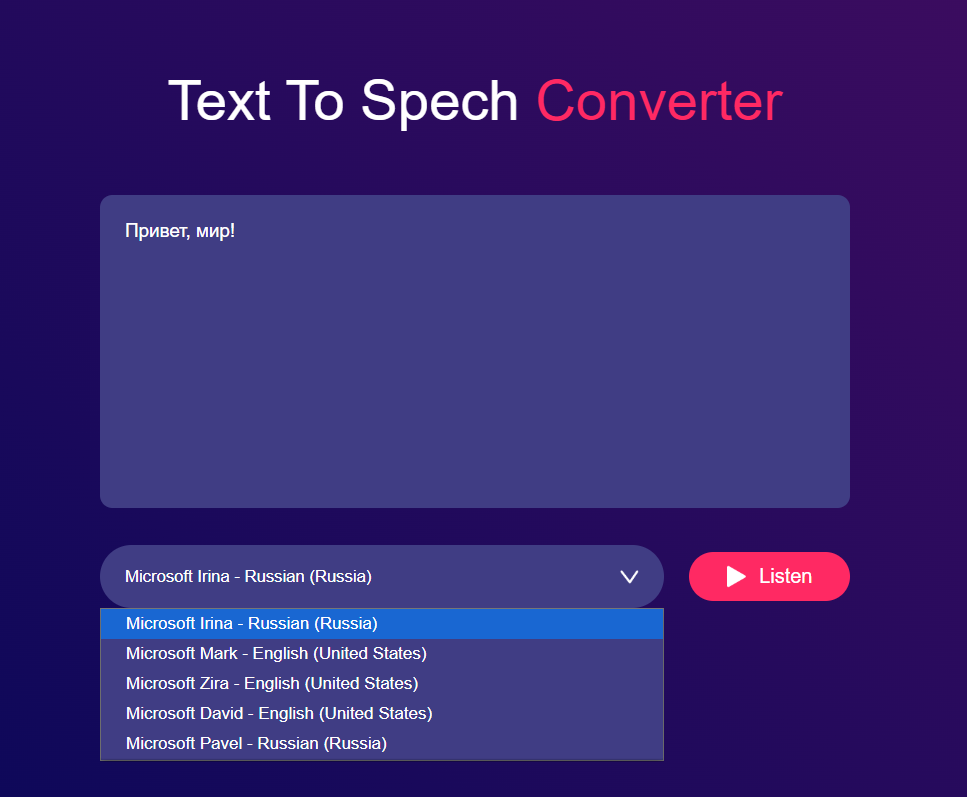

---

## 21. Coming Soon Page

Страница обратного отсчёта до события.  

---

## 22. Background Change Effect

Изменение фона изображения при взаимодействии.  

---

## 23. Mini Calendar

Мини-календарь с датой, днём, месяцем и годом сегодня. 
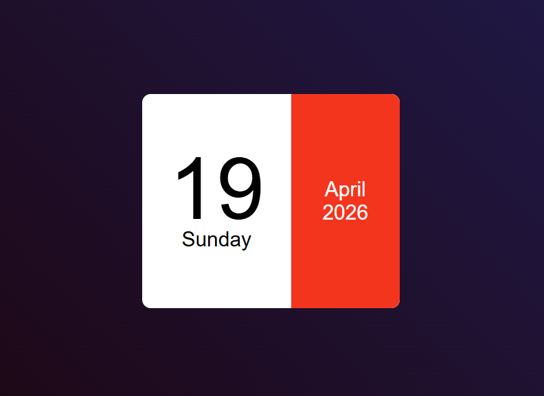

---

## 24. Menu

Выпадающее меню с выбором опций и соответствующей иконкой. 

---

## 25. Circular Progress Bar

Круговой индикатор прогресса с анимацией.  
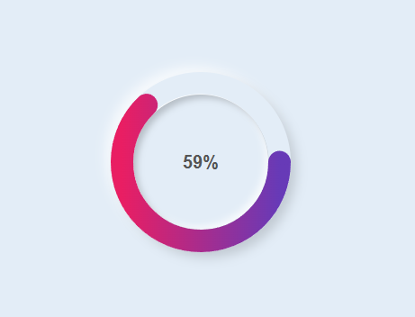

---

## 26. Product Page

Страница товара с выбором параметров и количеством, переключением между картинками. 
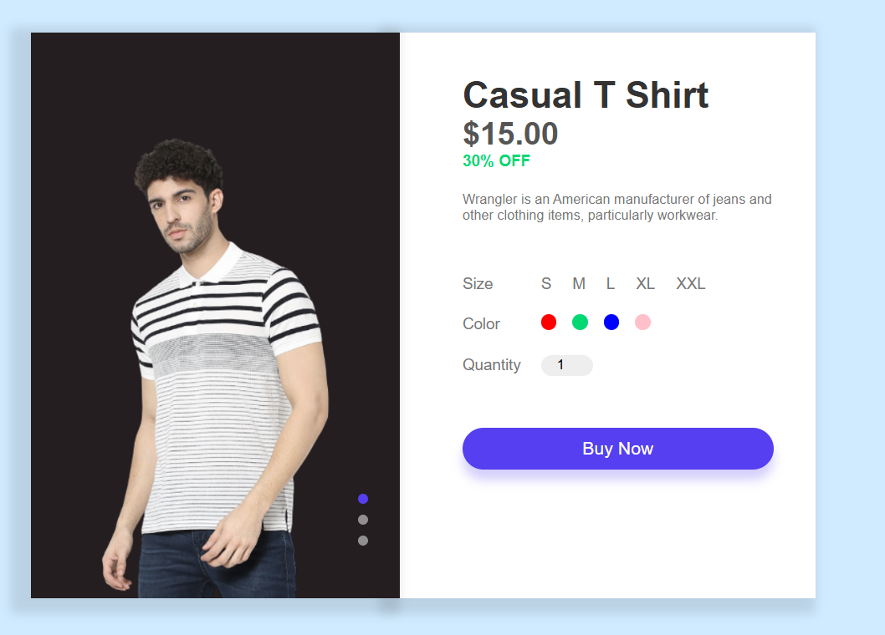

---

## 27. Cryptocurrency Tracker

Отображение курсов криптовалют в реальном времени через API.  

---

## 28. Drag and Drop

Перетаскивание элементов между блоками.  

---

## 29. Image Search Engine

Поиск изображений через API (Unsplash).  

---

## 30. Digital Clock

Цифровые часы в реальном времени.  
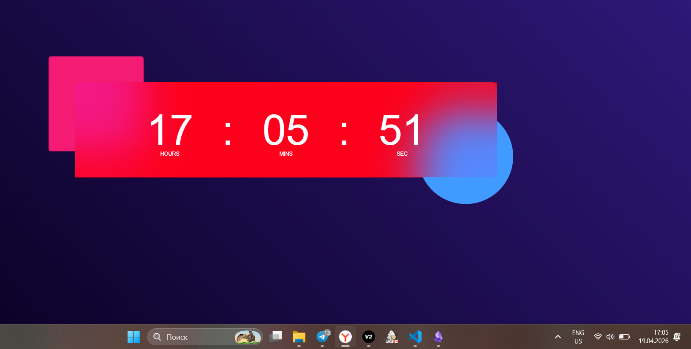

---

## Технологии

- HTML
- CSS
- JavaScript
- API (OpenWeatherMap, Unsplash и др.)
- LocalStorage
- Web APIs
