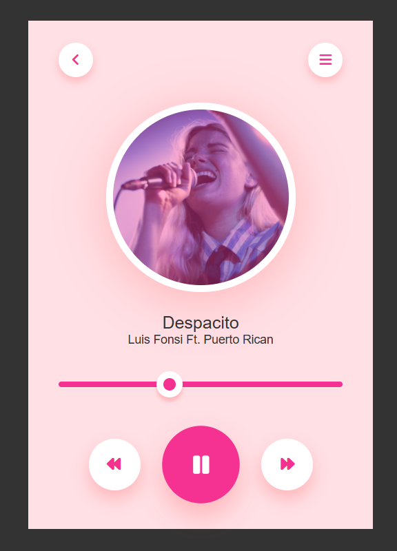
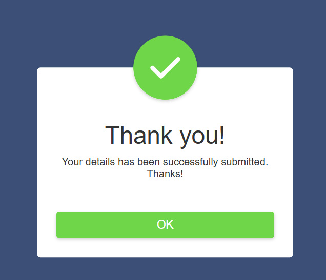
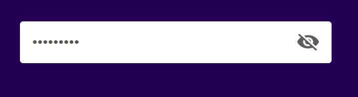
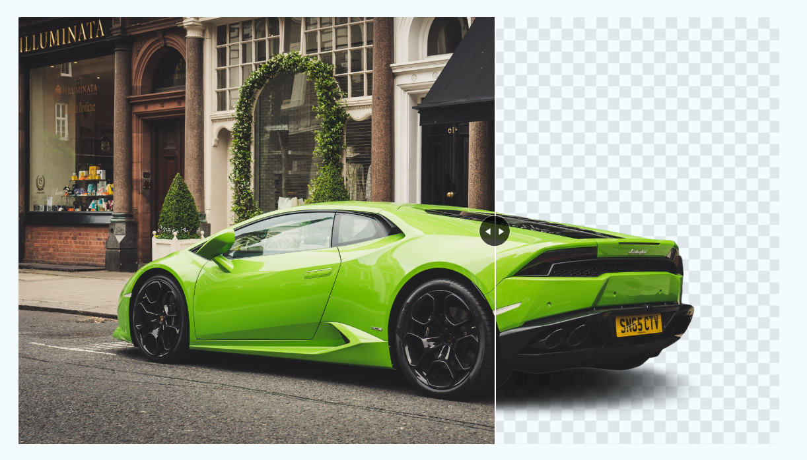
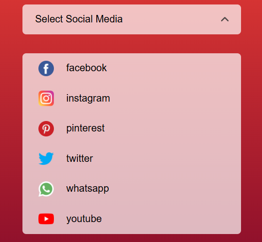
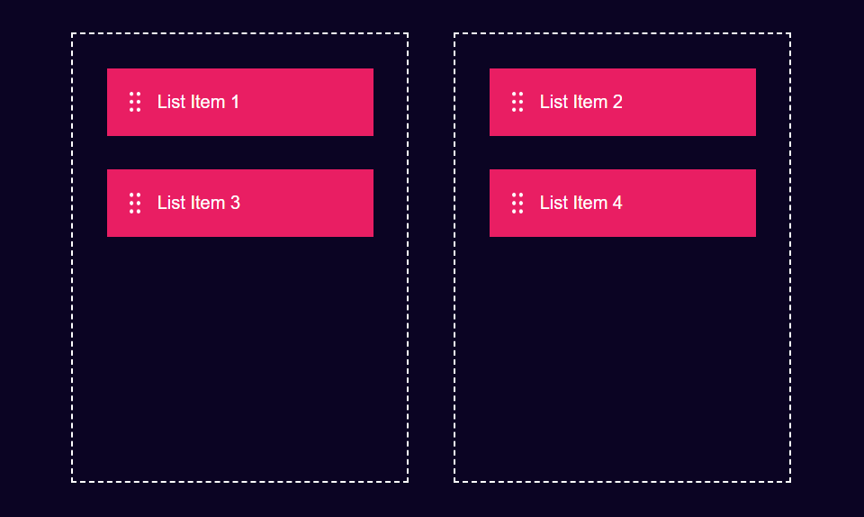
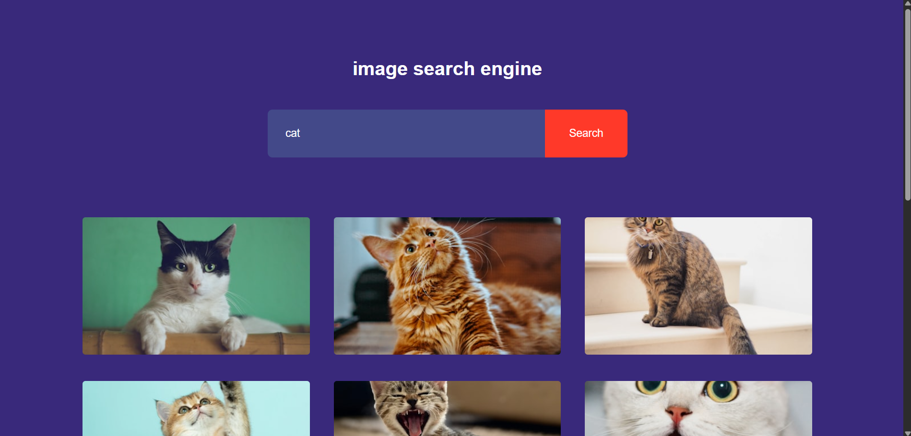
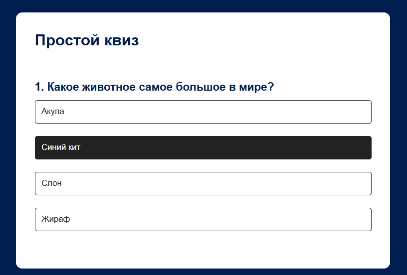
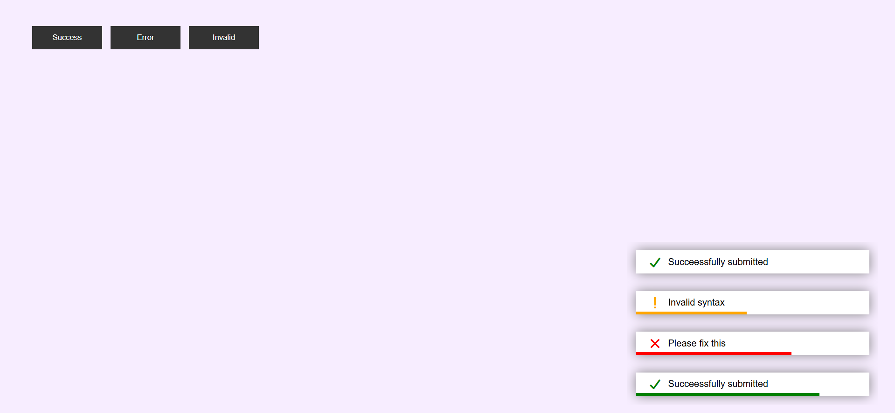

## Оглавление

1. [Weather App](#1-weather-app)
2. [To Do List](#2-to-do-list)
3. [Quiz App](#3-quiz-app)
4. [Random Password Generator](#4-random-password-generator)
5. [Notes App](#5-notes-app)
6. [Age Calculator](#6-age-calculator)
7. [Quote Generator](#7-quote-generator)
8. [QR Code](#8-qr-code)
9. [Snack Bar](#9-snack-bar)
10. [Music Player](#10-music-player)
11. [Stopwatch](#11-stopwatch)
12. [Calculator](#12-calculator)
13. [Pop-up](#13-pop-up)
14. [Password](#14-password)
15. [Dark Mode](#15-dark-mode)
16. [Form Validation](#16-form-validation)
17. [Gallery](#17-gallery)
18. [Working Email Subscription](#18-working-email-subscription)
19. [Password Strength](#19-password-strength)
20. [Text to Speech](#20-text-to-speech)
21. [Coming Soon Page](#21-coming-soon-page)
22. [Image Background Change Effect](#22-image-background-change-effect)
23. [Mini Calendar](#23-mini-calendar)
24. [Menu](#24-menu)
25. [Circular Progress Bar](#25-circular-progress-bar)
26. [Product Page](#26-product-page)
27. [Cryptocurrency](#27-cryptocurrency)
28. [Drag and Drop](#28-drag-and-drop)
29. [Image Search Engine](#29-image-search-engine)
30. [Digital Clock](#30-digital-clock)

---
## 1. Weather App

Приложение для отображения погоды по городу. Использует API (OpenWeatherMap). Отображает температуру, влажность, скорость ветра и иконку погоды.

## 2. To Do List

Список задач с возможностью добавления, удаления и отметки выполненных задач. Данные сохраняются в localStorage.

## 3. Quiz App

Приложение с вопросами и вариантами ответов. Подсчитывает количество правильных ответов и показывает результат в конце.

## 4. Random Password Generator

Генератор случайных паролей с настройками длины и возможностью выбора символов (цифры, буквы верхнего и нижнего регистра, спецсимволы), из которых будет составлен пароль.

## 5. Notes App

Приложение для создания и хранения заметок. Поддерживает редактирование, удаление и сохранение в localStorage.

## 6. Age Calculator

Калькулятор возраста. Пользователь вводит дату рождения, приложение показывает точный возраст в годах, месяцах и днях.

## 7. Quote Generator

Генератор случайных цитат. При нажатии на кнопку загружает новую цитату через API.

## 8. QR Code

Генератор QR-кода. Пользователь вводит текст или ссылку, приложение генерирует QR-код с помощью API.

## 9. Snack Bar

Всплывающие уведомления, которые появляются на короткое время и исчезают. Поддерживает разные типы (успех, ошибка, предупреждение).

## 10. Music Player

Проигрыватель аудиофайла. Поддерживает воспроизведение, паузу, перемотку и отображение времени.

## 11. Stopwatch

Секундомер с кнопками "Старт", "Пауза", "Сброс".

## 12. Calculator

Базовый калькулятор с поддержкой основных операций (сложение, вычитание, умножение, деление) и десятичных чисел. Возможно удаление символов и очистка экрана.

## 13. Pop-up

Модальное окно (попап), которое появляется по нажатию на кнопку. Закрывается по нажатию кнопки.

## 14. Password

Поле ввода пароля с возможностью показать/скрыть введенные символы (глазик).

## 15. Dark Mode

Переключение между светлой и темной темой интерфейса. Состояние темы сохраняется в localStorage.

## 16. Form Validation

Форма регистрации с валидацией полей (имя, email, телефон). Выводит сообщения об ошибках в реальном времени.

## 17. Gallery

Галерея изображений с возможностью листать колесиком мышки и навигацией между фото.

## 18. Working Email Subscription

Форма подписки по email

## 19. Password Strength

Индикатор сложности пароля. Оценивает длину, наличие цифр, спецсимволов, букв в разных регистрах. Показывает уровень (слабый/средний/сильный).

## 20. Text to Speech

Преобразование текста в речь с помощью Web Speech API. Пользователь вводит текст, нажимает кнопку, и текст озвучивается.

## 21. Coming Soon Page

Страница с обратным отсчетом до указанной даты. Показывает дни, часы, минуты и секунды.

## 22. Image Background Change Effect

Эффект смены фона изображения. При использовании слайдера у картинки пропадает фон

## 23. Mini Calendar

Компактный календарь, отображающий какой сегодня день, число, месяц, год. Позволяет переключать месяцы.

## 24. Menu

Выпадающий список с возможностью выбора конкретного варианта и иконкой, которая "открывает" и "закрывает" список

## 25. Circular Progress Bar

Круговой индикатор прогресса с анимацией

## 26. Product Page

Карточка товара с изображением, описанием, ценой и выбором количества, цвета. Может включать добавление в корзину (имитация).

## 27. Cryptocurrency

Приложение для отображения курса криптовалют (Bitcoin, Ethereum и Doge) в реальном времени с помощью API.

## 28. Drag and Drop

Интерфейс с возможностью перетаскивать элементы (drag & drop) из одного блока в другой

## 29. Image Search Engine

Поиск изображений по ключевым словам через API (Unsplash или Pixabay). Отображает результаты в виде сетки картинок.

## 30. Digital Clock

Цифровые часы с отображением времени (часы:минуты:секунды). Обновляются в реальном времени каждую секунду.

